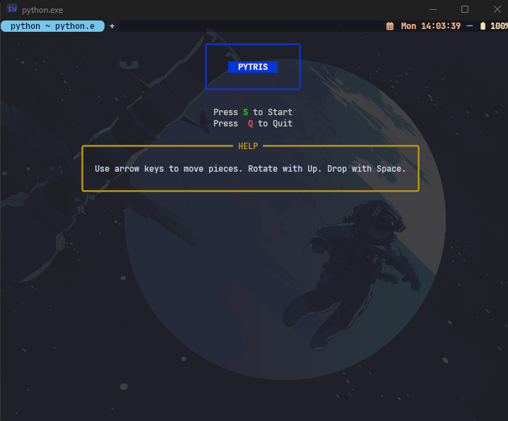
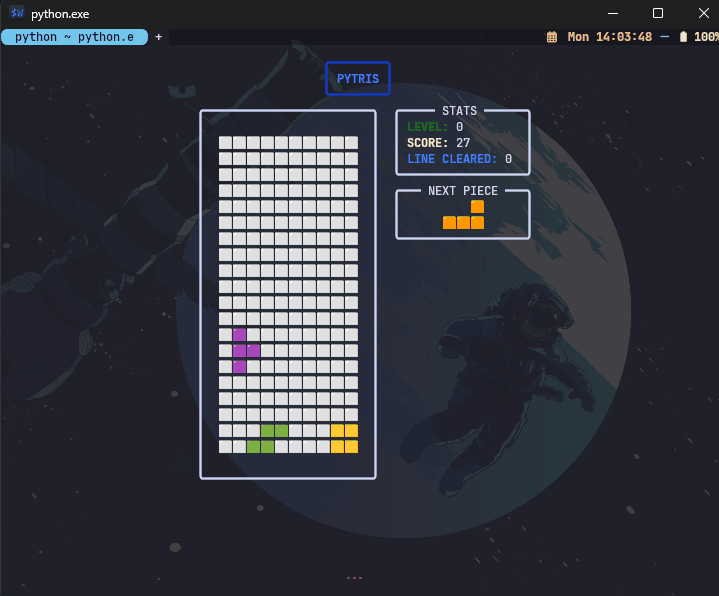

# Pytris (CLI Tetris)

A terminal-based Tetris clone written in Python, featuring a rich interactive UI powered by Rich and background music via Pygame.

---

## Features

- Classic Tetris gameplay in your terminal
- Colorful block rendering using emojis and Rich
- Smooth, non-blocking input handling with threading
- Adjustable drop speed and level progression
- Next-piece preview
- Background music and sound effects via Pygame
- Modular code architecture (Game, UI, Board, Piece, State)
- Configurable controls and settings

## Demo




---

## Installation

### 1. Clone the repository

```bash
git clone https://github.com/yourusername/pytris.git
cd pytris
```

### 2. Create a virtual environment (optional but recommended)

```bash
python -m venv venv
source venv/bin/activate  # On Linux/Mac
venv\Scripts\activate     # On Windows
```

### 3. Install dependencies

```bash
pip install -r requirements.txt
```

**Required libraries**:

- Python 3.8+
- `rich` for terminal rendering
- `pygame` for audio playback

---

## Usage

Run the game script:

```bash
python main.py
```

You should see the Pytris menu. Use the following keys to control the game:

| Key             | Action                     |
| --------------- | -------------------------- |
| `s`             | Start game from menu       |
| `q`             | Quit (menu / game over)    |
| Arrow keys      | Move piece left/right/down |
| `w` or Up arrow | Rotate piece               |
| `p`             | (Future) Pause the game    |

---

## Project Structure

```
pytris/
├── main.py         # Entry point, starts the game
├── game.py         # Game logic, state management, threads
├── ui.py           # Rendering screens with Rich
├── board.py        # Board grid and collision logic
├── piece.py        # Tetromino definitions and rotation
├── player.py       # Music and sound player
├── config.py       # Constants (COLS, ROWS, speed, colors, blocks)
├── state.py        # GameState and ScreenMode definitions
├── screen_mode.py  # Enum for MENU, PLAYING, GAME_OVER
├── assets/         # music/, sounds/, demo.gif
├── requirements.txt
└── README.md       # You are here
```

---

## Configuration

You can adjust game parameters in `config.py`:

- `COLS`, `ROWS`: Board dimensions
- `BASE_SPEED`: Initial drop interval (seconds)
- `SCORE_RULE`: Points per line clear
- `TETROMINOES`: Shapes and colors
- `BLOCK_MAP`: Emoji or character for each color
- `BASE_BOLUME`: Change base volume of the game
- `SOUNDS`: List of sounds used in the game
- `MUSIC`: List of musics used in the game

---

## Contributing

Contributions, issues, and feature requests are welcome!\
Feel free to fork the repo and submit a Pull Request.

1. Fork it
2. Create your feature branch (`git checkout -b feature/fooBar`)
3. Commit your changes (`git commit -am 'Add some fooBar'`)
4. Push to the branch (`git push origin feature/fooBar`)
5. Open a Pull Request

---

## License

This project is licensed under the MIT License. See [LICENSE](LICENSE) for details.

---

Have fun playing Pytris! 🎮